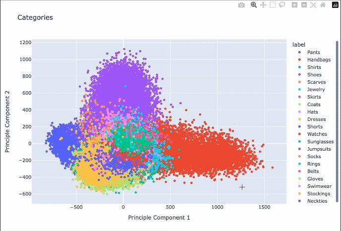

The purpose of the project is to recommend visually similar images by using image representations obtained through a Neural Network Architecture and using Similarity Search Index for retrieval and ranking. Sample results is available in the sample-results folder.

#### The full analysis, recommendations, and high-level overview of each step is available here:
<a href="https://www.joankusuma.com/post/fashion-recommender-system-with-visual-similarity-search"> Fashion Recommender System</a>

Scatter Plot from <b>similarity_search_indexes.ipynb</b> is a plotly animated file and can't be loaded on github, here's a preview of it in gif format:
<figure>
    

</figure>
 

#### The dataset for the fashion-recommender-v1 is available <a href="https://github.com/eileenforwhat/complete-the-look-dataset/tree/master">here</a>:

  <pre>
    @online{Eileen2020,
  author       = {Eileen Li, Eric Kim, Andrew Zhai, Josh Beal, Kunlong Gu},
  title        = {Bootstrapping Complete The Look at Pinterest},
  year         = {2020}
}
  </pre>

